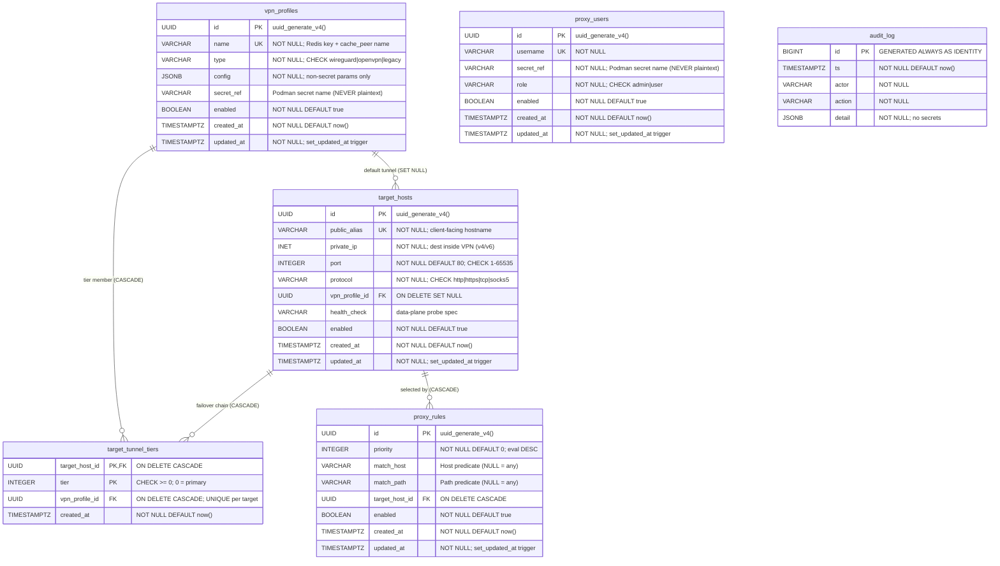

# Helix Proxy — Database (VPN-Aware Dynamic Routing Extension)

**Revision:** 1
**Last modified:** 2026-06-30T00:00:00Z
**Status:** Draft (data-model deliverable for the VPN-aware proxy extension)
**Authority:** Inherits the Helix Constitution submodule (`constitution/Constitution.md`) per §11.4.35. Design source: `docs/superpowers/specs/2026-06-30-vpn-aware-proxy-extension-design.md` §6.
**Scope:** The PostgreSQL control-plane source of truth. DDL: `sql/schema.sql`; migrations: `sql/migrations/`; example data: `sql/seed_example.sql`; ER diagram: `docs/diagrams/database_er.mermaid`.

---

## 1. What this database is (plain language)

The Helix Proxy lets a client reach private servers that are only reachable
**through a VPN**. This database is the **control panel's memory**: it records
*which VPN tunnels exist*, *which private servers (targets) live behind them*,
*which tunnel to try first and which to fall back to if that tunnel goes down*,
*which incoming requests map to which target*, *who is allowed to use the
proxy*, and *a history of every change*. The proxy software reads this database
to build its live configuration; it never stores passwords here.

**One golden rule (security, §11.4.10):** this database **never** holds a
password, private key, or any secret. It only stores the **name of a Podman
secret** (a `secret_ref`) where the real credential is kept. If you read every
row of every table out loud, you leak nothing.

## 2. The six tables at a glance

| Table | Plain-language purpose |
|---|---|
| `vpn_profiles` | The VPN tunnels you can route through (one row = one tunnel). |
| `target_hosts` | The private servers you want to reach through a tunnel. |
| `target_tunnel_tiers` | The ordered "try this tunnel first, then this one" failover list for each target. |
| `proxy_rules` | The "if a request looks like X, send it to target Y" matching rules. |
| `proxy_users` | The people/services allowed to use the proxy (auth identities, no passwords). |
| `audit_log` | An append-only diary of every change and security event. |

## 3. Entity-relationship diagram



> The diagram source is `docs/diagrams/database_er.mermaid` and matches the DDL
> exactly. `||--o{` reads "one-to-many": one VPN profile can be the default
> tunnel for many targets, etc.

## 4. Table-by-table reference (for engineers)

### 4.1 `vpn_profiles`
One row per VPN tunnel. In the running system, **one profile = one gluetun
container = one network namespace = one Redis key `vpn:status:<name>`** (spec
§5/§7).

| Column | Type | Notes |
|---|---|---|
| `id` | `uuid` PK | `uuid_generate_v4()`. |
| `name` | `varchar(255)` UNIQUE NOT NULL | Used verbatim as the Redis status-key suffix and the Squid `cache_peer` name. Bindings are by **name, not index** (§11.4.111). |
| `type` | `varchar(50)` NOT NULL | CHECK `wireguard \| openvpn \| legacy`. `legacy` = the retained-but-deprecated `dperson/openvpn-client` (kept, not removed — §11.4.122). |
| `config` | `jsonb` NOT NULL | Non-secret tunnel parameters only (endpoint, allowed_ips, DNS, MTU, provider knobs, `*_ref` pointers). |
| `secret_ref` | `varchar(255)` | Name of the Podman secret with the tunnel credentials. **Never the secret itself** (§11.4.10). |
| `enabled` | `bool` NOT NULL | When false the compiler omits it and the health-publisher stops polling it. |
| `created_at` / `updated_at` | `timestamptz` NOT NULL | `updated_at` maintained by the `set_updated_at` BEFORE-UPDATE trigger. |

### 4.2 `target_hosts`
A backend reachable (typically) only through a tunnel.

| Column | Type | Notes |
|---|---|---|
| `id` | `uuid` PK | — |
| `public_alias` | `varchar(255)` UNIQUE NOT NULL | The client-facing hostname (Squid Host header / Dante destination match). |
| `private_ip` | `inet` NOT NULL | Destination inside the VPN; IPv4 or IPv6 (dual-stack, §11⑦). |
| `port` | `int` NOT NULL DEFAULT 80 | CHECK 1–65535. |
| `protocol` | `varchar(10)` NOT NULL DEFAULT `http` | CHECK `http \| https \| tcp \| socks5`. |
| `vpn_profile_id` | `uuid` FK → `vpn_profiles(id)` | **ON DELETE SET NULL** — deleting a profile orphans the target (it stops routing) rather than deleting it. Default/primary tunnel; the ordered chain lives in `target_tunnel_tiers`. |
| `health_check` | `varchar(500)` | Data-plane probe spec (URL or host:port) — a real signal, not a "configured" claim (spec §13). |
| `enabled` | `bool` NOT NULL | — |
| `created_at` / `updated_at` | `timestamptz` NOT NULL | Trigger-maintained `updated_at`. |

### 4.3 `target_tunnel_tiers`
The ordered failover chain per target (spec §11 feature ①). `tier 0` = primary;
the circuit-breaker (external-acl-helper, `sony/gobreaker`) walks tiers ascending
until it finds an "up" tunnel, else returns a graceful 503.

| Column | Type | Notes |
|---|---|---|
| `target_host_id` | `uuid` PK part, FK → `target_hosts(id)` | **ON DELETE CASCADE.** |
| `tier` | `int` PK part | CHECK ≥ 0. `PRIMARY KEY (target_host_id, tier)` ⇒ one tunnel per tier per target. |
| `vpn_profile_id` | `uuid` FK → `vpn_profiles(id)` | **ON DELETE CASCADE.** `UNIQUE (target_host_id, vpn_profile_id)` ⇒ a tunnel appears at most once in a target's chain. |
| `created_at` | `timestamptz` NOT NULL | — |

Index: `idx_ttt_profile (vpn_profile_id)`.

### 4.4 `proxy_rules`
Request-matching rules selecting a target. Evaluated **highest `priority`
first** (`ORDER BY priority DESC`). A `NULL` predicate matches anything, but a
CHECK requires **at least one** of `match_host` / `match_path` to be set.

| Column | Type | Notes |
|---|---|---|
| `id` | `uuid` PK | — |
| `priority` | `int` NOT NULL DEFAULT 0 | Higher wins. |
| `match_host` | `varchar(255)` | Host predicate; NULL = any. |
| `match_path` | `varchar(500)` | Path predicate; NULL = any. |
| `target_host_id` | `uuid` FK → `target_hosts(id)` | **ON DELETE CASCADE.** |
| `enabled` | `bool` NOT NULL | — |
| `created_at` / `updated_at` | `timestamptz` NOT NULL | Trigger-maintained `updated_at`. |

Indexes: `idx_proxy_rules_priority (priority DESC)`, `idx_proxy_rules_target
(target_host_id)`, partial `idx_proxy_rules_match_host (match_host) WHERE enabled`.

### 4.5 `proxy_users`
Per-user proxy-auth identities (Squid auth + control-API, §12 zero-trust).
**No password column ever** — only a `secret_ref` naming a Podman secret.

| Column | Type | Notes |
|---|---|---|
| `id` | `uuid` PK | — |
| `username` | `varchar(255)` UNIQUE NOT NULL | — |
| `secret_ref` | `varchar(255)` NOT NULL | Podman-secret name; CHECK non-empty after trim. **Never plaintext** (§11.4.10). |
| `role` | `varchar(50)` NOT NULL DEFAULT `user` | CHECK `admin \| user`. |
| `enabled` | `bool` NOT NULL | — |
| `created_at` / `updated_at` | `timestamptz` NOT NULL | Trigger-maintained `updated_at`. |

### 4.6 `audit_log`
Append-only audit trail. The application never UPDATEs or DELETEs rows
(retention/rotation is operational).

| Column | Type | Notes |
|---|---|---|
| `id` | `bigint` PK | `GENERATED ALWAYS AS IDENTITY` (monotonic). |
| `ts` | `timestamptz` NOT NULL | Event time (UTC). |
| `actor` | `varchar(255)` NOT NULL | `proxy_users.username`, a service name, or `system`. |
| `action` | `varchar(100)` NOT NULL | Verb (e.g. `profile.create`, `tunnel.failover`, `user.login`). |
| `detail` | `jsonb` NOT NULL | Structured payload; **no secret material** (§11.4.10). |

Indexes: `idx_audit_log_ts (ts DESC)`, `idx_audit_log_actor`, `idx_audit_log_action`.

## 5. Relationships & delete behaviour (why it's safe)

- **Profile → Target (`vpn_profile_id`, SET NULL):** deleting a tunnel does not
  delete the servers behind it; they become unrouted (NULL) until reassigned —
  no silent data loss.
- **Target → Tiers / Rules (CASCADE):** a tier row or rule has no meaning
  without its target, so deleting the target cleans them up automatically — no
  orphans.
- **Profile → Tiers (CASCADE):** a failover-tier row referencing a deleted
  tunnel is meaningless, so it is removed; other tiers of the same target
  remain.

## 6. How to apply

```bash
# Full declarative schema (fresh DB):
psql -v ON_ERROR_STOP=1 -f sql/schema.sql

# Or forward migration (recorded in schema_migrations, idempotent):
psql -v ON_ERROR_STOP=1 -f sql/migrations/0001_init.sql

# Example NON-SECRET data (idempotent for data tables; audit_log appends):
psql -v ON_ERROR_STOP=1 -f sql/seed_example.sql
```

## 7. Validation evidence (anti-bluff, §11.4.6 / §11.4.123)

This schema was validated against a **real, live PostgreSQL 16.14** instance
booted in a throwaway rootless-Podman container (`postgres:16-alpine`,
§11.4.161) — not a dry parse. Captured evidence is under
`qa-results/datamodel/<run-id>/`:

| Check | Result |
|---|---|
| `sql/schema.sql` applied to clean DB | exit 0, zero errors |
| `sql/migrations/0001_init.sql` applied twice | both exit 0; ledger has exactly one row; 2nd run honored "already applied — skipping" |
| `sql/seed_example.sql` applied twice | exit 0; data tables idempotent; `audit_log` correctly appends |
| `\d+` for all six tables | all columns, comments, constraints, indexes, FKs, 4 triggers present |
| `updated_at` trigger on UPDATE | `updated_at > created_at` confirmed |
| CHECK constraints (bad type / port / missing predicate / empty secret_ref / duplicate tier) | each correctly **rejected** |
| FK ON DELETE CASCADE / SET NULL | tiers + rules cascade-cleaned; no orphans |
| Secret-leak self-audit (§11.4.10) | only policy-documentation comments matched; **no key material** in any SQL file |

**Honest scope (§11.4.3):** this proves the DDL is syntactically and
structurally correct and behaves as specified on a real engine. Full
**integration** validation against the running control-plane (Go services,
Redis bus, gluetun tunnels, Squid/Dante) is **deferred to the integration phase**
of the build (spec §13/§17) — it requires services not present in this
data-model task's environment.
