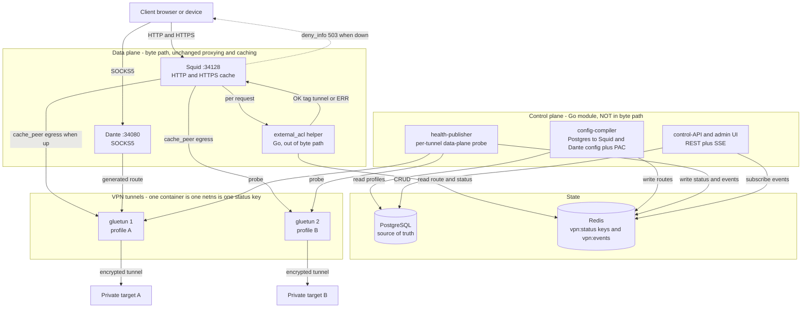
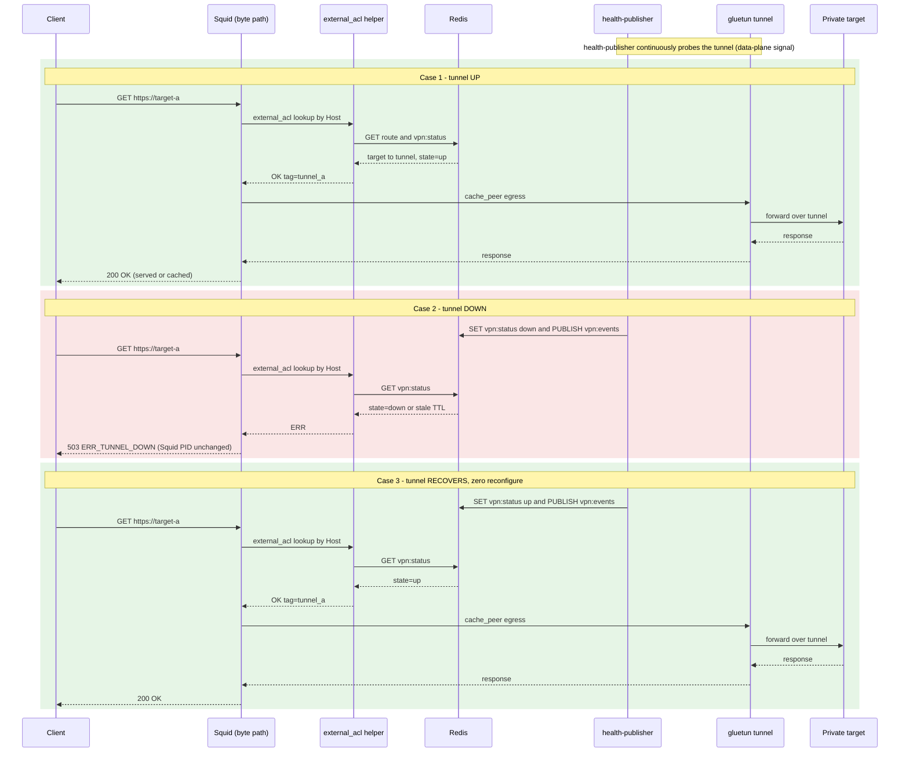

# Helix Proxy — VPN-Aware Dynamic Routing

**Revision:** 1
**Last modified:** 2026-06-30T00:00:00Z
**Status:** DESIGN — NOT YET IMPLEMENTED. This document describes the *intended*
control-plane for VPN-aware dynamic routing. No code, container, or test for the
`dynamic` mode exists in this repository yet; every behaviour below is written as
a design intention ("will" / "is designed to"), never as a working claim
(Constitution §11.4.6 — no false "implemented" assertions).
**Authority:** Inherits the Helix Constitution submodule (`constitution/Constitution.md`) per §11.4.35.
**Design source:** `docs/superpowers/specs/2026-06-30-vpn-aware-proxy-extension-design.md`.

---

## 1. Plain-language overview (for everyone)

Today the Helix Proxy can send **all** of its traffic through **one** VPN tunnel,
or through **no** VPN at all. That is an all-or-nothing choice made once, when the
service starts.

The **dynamic routing** extension is designed to make that choice **per
destination** and **live**. In everyday terms, it will let you say things like:

- "Send requests for *server A* through *VPN tunnel 1*, and requests for
  *server B* through *VPN tunnel 2*." Different destinations, different tunnels,
  **at the same time** — multiple tunnels running concurrently.
- "If the tunnel a destination needs is **down**, don't hang and don't silently
  leak my traffic — give me an **instant, clean 'service unavailable' (HTTP 503)**
  so I know exactly what happened." When the tunnel comes back, requests start
  working again on their own — **no restart, no reconfiguration**.

Why this matters: it lets one proxy reach many private servers that each live
behind a *different* VPN, it fails **gracefully and visibly** instead of leaving
you guessing, and it recovers by itself. The design keeps the existing caching
proxy doing its job, so web pages still load fast from the local cache.

> This is a planned capability. None of it is built yet — see the Status line
> above.

## 2. The four operating modes

The three existing modes are **preserved** (they will not be removed —
Constitution §11.4.122). The `dynamic` mode is the **new, additive** fourth mode.

| Mode | How traffic is routed | Tunnels | Per-target choice | Down-tunnel behaviour | Status |
|---|---|---|---|---|---|
| `vpn` (existing) | All proxy traffic shares one VPN container's network namespace | One | No — all or nothing | Dropped / hung (no clean signal) | Shipped |
| `host-vpn` (existing) | Proxy runs on the host network and uses the host's own VPN | One (host's) | No | Depends on host VPN | Shipped |
| `no-vpn` (existing) | Direct to the internet, bridge network, local caching only | None | N/A | N/A | Shipped |
| `dynamic` (NEW) | Each destination is routed to a chosen VPN profile; a control-plane publishes live tunnel state | Many, concurrent | **Yes** — per target, with ordered failover tiers | **Instant graceful 503**, auto-recovers | **DESIGN ONLY — not built** |

The existing `dperson/openvpn-client` VPN is designed to be retained inside the
`dynamic` mode as a `legacy` profile (marked deprecated, **not** removed).

## 3. Architecture (for engineers)

### 3.1 The out-of-byte-path principle

The single most important design decision: **the control-plane never sits in the
request byte path.** Squid (HTTP/HTTPS + cache) and Dante (SOCKS5) keep doing all
the actual proxying and caching, exactly as they do today. The new Go
control-plane is **not** a reverse proxy — it is three cooperating roles that sit
*beside* the data plane:

1. **config-compiler** — reads PostgreSQL and renders the static parts of the
   Squid / Dante configuration (per-tunnel `cache_peer` entries, Dante routes, a
   PAC file). It only touches the proxies for **structural** changes (a new
   tunnel or peer appears) via `reconfigure` / `SIGHUP` — **never** for a tunnel
   merely going up or down.
2. **health-publisher** — one watcher per tunnel. It will determine tunnel health
   from **data-plane facts** (gluetun control API, a `wg show` byte-transfer
   delta, and a live egress probe), never from "it is configured", and write the
   result into Redis.
3. **external_acl helper** — a tiny Go binary that Squid calls **per request**
   through Squid's native `external_acl_type` hook. It reads Redis and answers
   `OK tag=<tunnel>` (route this request to that tunnel's peer) or `ERR` (which
   Squid turns into a branded `deny_info 503`).

This preserves Squid's mature caching **and** adds dynamic per-target VPN
selection plus a graceful 503 with **zero reconfigure** on every up/down flip.

### 3.2 The gluetun-per-profile model

Each VPN profile is designed to be **one `gluetun` container = one network
namespace = one Redis status key** (`vpn:status:<profile>`). This maps 1:1 onto
the existing `network_mode: service:<vpn>` pattern the project already uses, so it
extends rather than reinvents the current approach. Kernel WireGuard is the
preferred tunnel type (throughput, CPU, audit surface), with OpenVPN retained for
compatibility.

### 3.3 PostgreSQL vs Redis — two stores, two jobs

- **PostgreSQL — the source of truth.** Durable configuration: VPN profiles,
  target hosts, proxy rules, ordered failover tiers, users, and an audit log. The
  control-plane *reads* it to build configuration; it changes slowly and only via
  the admin API. Full schema and ER diagram: `docs/DATABASE.md`.
- **Redis — the live state and event bus.** Fast, ephemeral, per-request:
  `vpn:status:<profile>` (current up/down + handshake age + byte counters +
  egress IP, with a TTL so a **stale key is treated as down — fail-closed**),
  `vpn:events` (pub/sub so the helper and UI react instantly), and `route:<target>`
  (the compiler-resolved tunnel + tier + breaker state).

### 3.4 Architecture diagram

Diagram source: `docs/diagrams/dynamic_routing_architecture.mermaid` (kept valid
so it can later be export-validated per §11.4.168).

## 4. Request lifecycle

The intended path of a single HTTP/HTTPS request in `dynamic` mode:

1. **Client → Squid.** The client points at Squid (`:34128`) exactly as today.
2. **Squid → external_acl helper.** Before choosing an upstream, Squid calls the
   Go helper through `external_acl_type`, passing the request's `Host`.
3. **Helper → Redis.** The helper reads `route:<target>` and
   `vpn:status:<profile>` to learn `{target → tunnel, up?}`.
4. **Routing decision:**
   - **Tunnel up →** helper returns `OK tag=tun_<profile>`; Squid sends the
     request out through that tunnel's `cache_peer` (egress via the matching
     gluetun container), serving from cache where possible.
   - **Tunnel down / Redis stale →** helper returns `ERR`; Squid returns a
     **branded `deny_info 503` (`ERR_TUNNEL_DOWN`)**. Crucially, the Squid process
     is **unchanged** — this is a clean L7 signal, not a crash.
5. **Auto-recovery — zero reconfigure.** When the tunnel returns, the
   health-publisher flips `vpn:status:<profile>` back to up and publishes
   `vpn:events`. The very next request gets `OK` from the helper and succeeds.
   **No `reconfigure`, no `SIGHUP`, no restart** — only the per-request Redis
   read changed its answer.

This same Redis-driven flip is what delivers **circuit-breaker tier-failover**:
if a target's primary tunnel is unhealthy, the helper is designed to fail over to
the next configured tier before falling back to the 503.

### 4.1 Request sequence diagram

Diagram source: `docs/diagrams/dynamic_routing_sequence.mermaid`.

## 5. Failure modes (designed to fail closed)

The design's guiding rule is **fail-closed, never leak**:

- **Tunnel down →** branded 503, Squid PID unchanged (intended to be proven, not
  assumed).
- **Redis down / stale key →** fail-closed 503 — never fall through to a direct
  (leaking) request.
- **Circuit-breaker open for a target →** fail over to the next healthy tier, else
  503.
- **Control-plane crash →** Squid keeps serving its last good configuration
  (degrade, do not die).

These are **intended** behaviours; each will require captured data-plane evidence
(`tcpdump`, `wg transfer` delta, egress-IP probes) before it can be claimed to
work — see the spec's anti-bluff test strategy.

## 6. Cross-references

- **Design spec (full rationale, research mapping, test strategy):**
  `docs/superpowers/specs/2026-06-30-vpn-aware-proxy-extension-design.md`
- **Implementation plan (phasing P0–P12):**
  `docs/superpowers/plans/2026-06-30-vpn-aware-proxy-extension-plan.md`
- **Data model (PostgreSQL schema + ER diagram):** `docs/DATABASE.md`
- **Existing network modes (the three preserved modes):** `docs/NETWORK_MODES.md`
- **Existing system architecture:** `docs/ARCHITECTURE.md`
- **Caching behaviour (preserved under `dynamic`):** `docs/CACHE.md`
- **VPN configuration:** `docs/VPN.md`
- **Diagram sources:** `docs/diagrams/dynamic_routing_architecture.mermaid`,
  `docs/diagrams/dynamic_routing_sequence.mermaid`,
  `docs/diagrams/database_er.mermaid`

---

*Document status reminder: the VPN-aware dynamic-routing control-plane is a
design, not a shipped capability. This document will be updated to describe
observed, evidence-backed behaviour only as each phase of the companion plan is
implemented and verified.*
