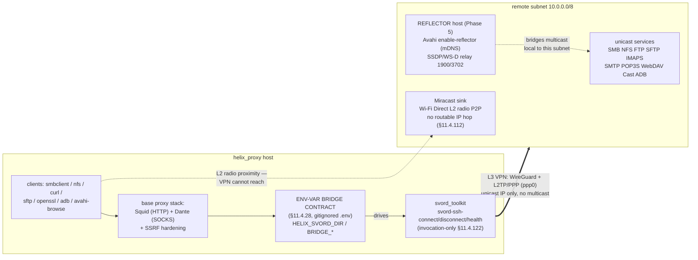
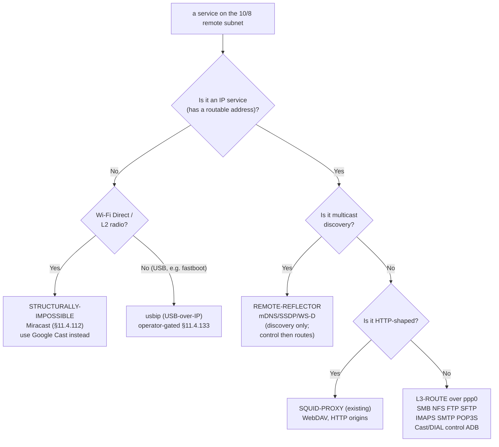
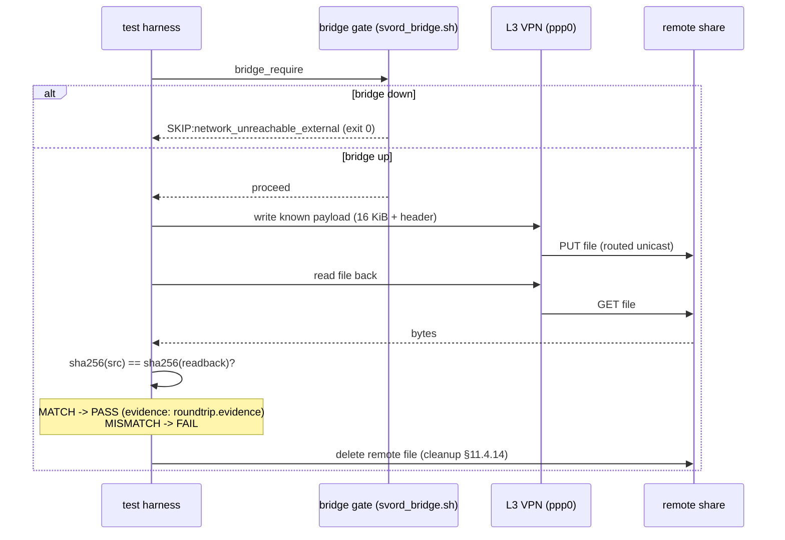
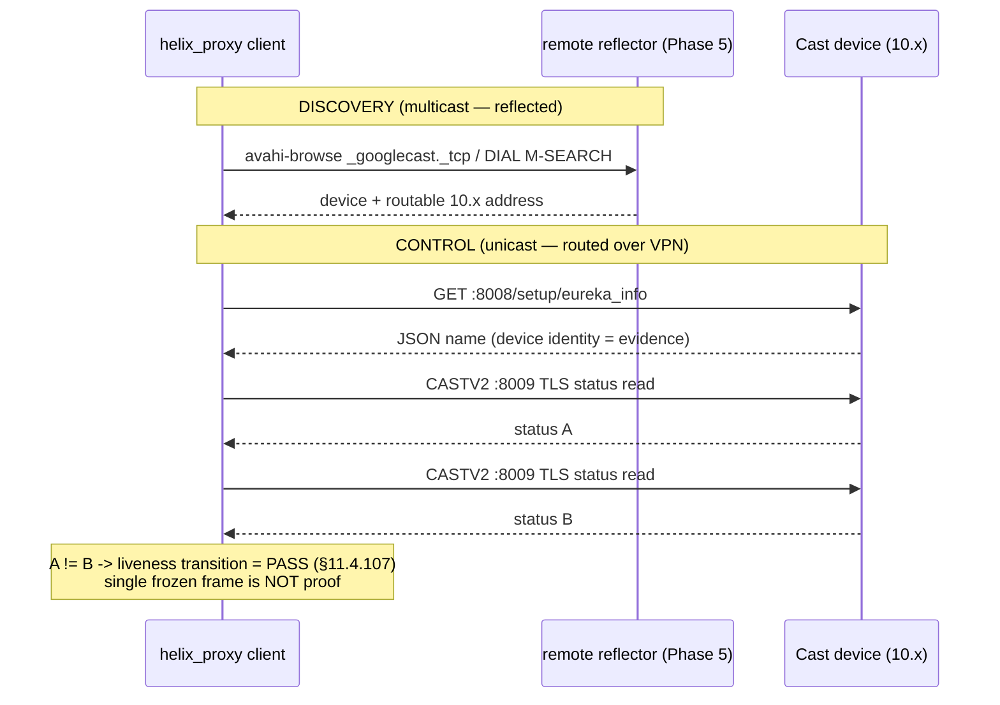
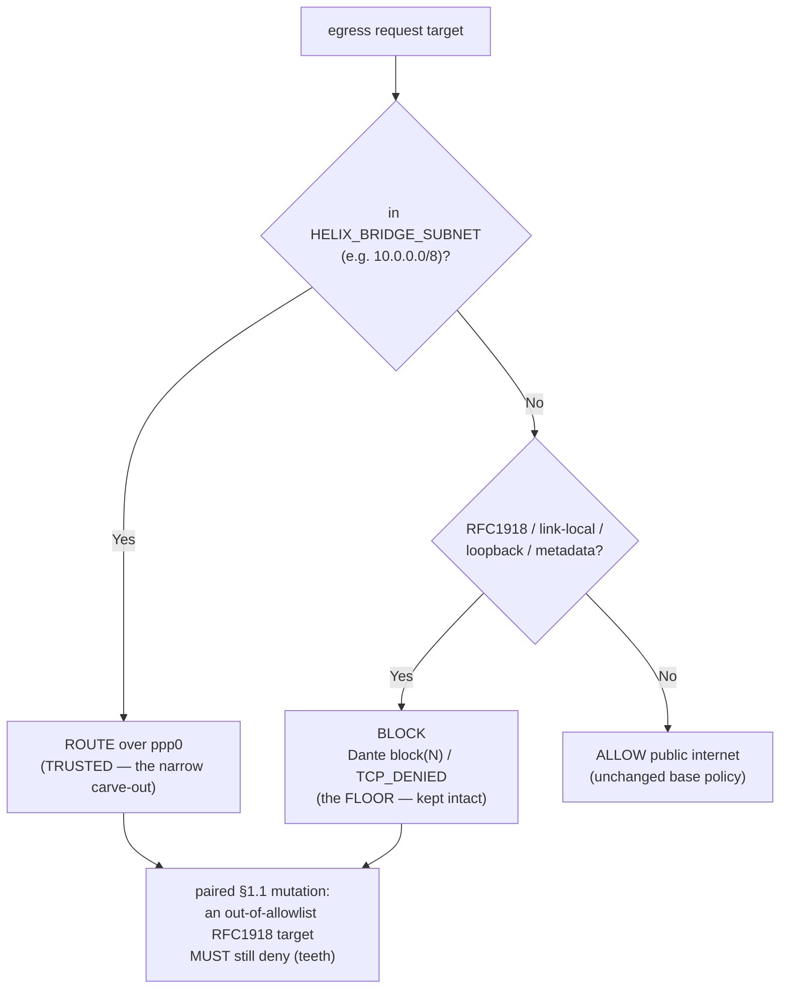

# VPN-LAN Service Access — Architecture, Schemes & Diagrams

**Revision:** 1
**Last modified:** 2026-07-01T16:30:58Z
**Status:** Design reference — architecture, topology & data-flow diagrams for the VPN-LAN service-access feature (Phase 9 docs of [`PLAN.md`](PLAN.md) §5)
**Authority:** Inherits `constitution/Constitution.md` per §11.4.35. Companion to [`PLAN.md`](PLAN.md) (§2 routing map, §3 bridge contract, §4 SSRF), [`reflector_design.md`](reflector_design.md) (Phase 5 discovery), [`miracast_verdict.md`](miracast_verdict.md) (Phase 8 verdict) and the operator setup guide [`../../guides/vpn_lan_bridge_setup.md`](../../guides/vpn_lan_bridge_setup.md). This document is the "schemes, diagrams, graphs" deliverable — it does not restate the setup steps (those live in the guide) or the per-phase task breakdown (that lives in `PLAN.md`); it draws the pictures those documents describe in prose.
**Feature workstream:** `feature/vpn-aware-dynamic-routing` (§11.4.167)

---

## 0. How to read this document

Every claim here is either grounded in the recon-derived FACTs recorded in
[`PLAN.md`](PLAN.md) §2 / §11 and the cited standards in
[`reflector_design.md`](reflector_design.md) / [`miracast_verdict.md`](miracast_verdict.md),
or explicitly marked **INFERENCE** (§11.4.6). Each diagram is drawn **twice** where the
operator asked for both forms — once as an **ASCII** rendering (human-readable in the PDF
export directly) and once as a **mermaid** source block (machine-renderable). Both carry the
same content; neither is a raw-markup leak — the ASCII block *is* the diagram, and the
mermaid block is its renderable twin (§11.4.168).

The single fact that drives every decision below: **the VPN is L3-routed** (WireGuard +
L2TP/PPP over `ppp0`; reachable subnet `10.0.0.0/8`; svord host `10.6.100.221`). A Layer-3
VPN routes unicast IP packets between reachable subnets — nothing more. That one property
sorts every in-scope protocol into exactly one of four buckets (§2).

---

## 1. System topology — helix_proxy ↔ svord bridge ↔ 10/8 remote subnet

The end-to-end picture: a helix_proxy-side client, the base proxy stack (Squid HTTP proxy +
Dante SOCKS with the SSRF hardening), the **env-var bridge contract** that decouples
helix_proxy from the sibling `svord_toolkit` project (§11.4.28), the L3 VPN link, and the
remote `10.0.0.0/8` subnet where the target services live.

### 1.1 ASCII topology

```text
        helix_proxy HOST                             |         REMOTE VPN-INTERNAL SUBNET
                                                     |              10.0.0.0/8
 ┌─────────────────────────────────────────────┐    |    ┌──────────────────────────────────┐
 │  helix_proxy-side clients                    │    |    │  target services (unicast IP)    │
 │  smbclient · mount.nfs · curl · sftp         │    |    │   SMB/445  NFS/2049  FTP/21       │
 │  openssl s_client · adb · avahi-browse       │    |    │   SFTP/22  IMAPS/993  SMTP/587    │
 └───────────────┬─────────────────────────────┘    |    │   POP3S/995  WebDAV(HTTP)         │
                 │                                    |    │   Cast 8008/8009  ADB 5555       │
       ┌─────────┴──────────┐                         |    │   host 10.6.100.221 (smoke)      │
       │ base proxy stack   │  HTTP-shaped only       |    └────────────────┬─────────────────┘
       │  Squid  (HTTP)     │  (WebDAV, HTTP origins) |                     │ unicast routes
       │  Dante  (SOCKS)    │                          |                     │
       │  + SSRF hardening  │                          |    ┌────────────────┴─────────────────┐
       │  (RFC1918 floor +  │                          |    │  REFLECTOR host (Phase 5)         │
       │   10/8 carve-out)  │                          |    │   Avahi enable-reflector (mDNS)  │
       └─────────┬──────────┘                          |    │   SSDP/WS-D relay (1900/3702)     │
                 │                                     |    │   224.0.0.251:5353               │
   ┌─────────────┴───────────────┐                     |    │   239.255.255.250:1900,3702      │
   │  ENV-VAR BRIDGE CONTRACT     │  invocation-only    |    └───────────────────────────────────┘
   │  (§11.4.28, NOT git-versioned)│  (§11.4.122)        |             ▲ multicast is LOCAL to
   │   HELIX_SVORD_DIR            │                      |             │ this subnet — routers do
   │   HELIX_BRIDGE_CONNECT       │───► svord-ssh-connect|             │ NOT forward it across L3
   │   HELIX_BRIDGE_DISCONNECT    │───► svord-ssh-disconn|             │ (reflector bridges it)
   │   HELIX_BRIDGE_HEALTH (exit0)│───► svord-ssh-health │             │
   │   HELIX_BRIDGE_SUBNET 10/8   │                      |    ┌────────┴──────────┐
   │   HELIX_BRIDGE_HOST  10.6..  │                      |    │ Miracast sink      │  Wi-Fi Direct
   └─────────────┬───────────────┘                      |    │ (L2 Wi-Fi-Direct)  │  L2 radio P2P —
                 │ drives                                |    └───────────────────┘  NO IP hop for
       ┌─────────┴──────────┐        L3 VPN link         |                            the VPN to route
       │  svord_toolkit     │   WireGuard + L2TP/PPP     |                            (§11.4.112)
       │  (sibling project) │═══════ ppp0 ══════════════▶|  routes 10.0.0.0/8 unicast IP only
       │  svord-ssh-* hooks │   unicast IP, no multicast |
       └────────────────────┘                            |
```

**Reading the picture:** helix_proxy never touches `svord_toolkit` internals — it invokes
only the four hook commands the contract names (`CONNECT` / `DISCONNECT` / `HEALTH` + the
two data vars `SUBNET` / `HOST`), so the whole VPN mechanism is swappable by editing one
`.env` (§11.4.28). Everything to the right of `ppp0` is reached by **unicast IP routing**;
multicast (the reflector's job) is confined to the remote subnet by IP scoping rules; and
Miracast's Wi-Fi-Direct radio group sits below IP entirely, where the VPN has no reach.

### 1.2 Mermaid topology (renderable twin)



---

## 2. Per-protocol routing decision table

Every in-scope protocol maps to exactly one of four **primitives**, decided by its traffic
class (FACT, [`PLAN.md`](PLAN.md) §2). This is the master decision table — the "WHY" column
is the load-bearing reason, not decoration.

| Protocol / service | Ports | Traffic class | Primitive | WHY (the deciding fact) |
|---|---|---|---|---|
| SMB / CIFS | 445 | Unicast TCP | **L3-ROUTE** | A mount is a unicast IP service; SOCKS5/Squid is the wrong primitive for mounts. Route it over `ppp0`. |
| NMB / NetBIOS name res. | 137–138 | Unicast UDP (fallback) | **L3-ROUTE** | Broadcast/multicast NMB is not routed across L3; target the share by its `10.x` IP (unicast) rather than NetBIOS name. |
| NFS | 2049 (+ aux) | Unicast TCP/UDP | **L3-ROUTE** | Same as SMB — a routed mount, not a proxied one. Needs L3 routing, not SOCKS5. |
| FTP control | 21 | Unicast TCP | **L3-ROUTE** | Control channel is a plain routed TCP connection. |
| FTP/FTPS data (passive) | pinned PASV range | Unicast TCP | **L3-ROUTE (pinned range)** | Passive data uses a separate port the server advertises; route the server's pinned passive-port range. FTPS encrypts the control channel so NAT/proxy ALGs cannot rewrite PASV — routing (not proxying) is the clean fit. |
| SFTP | 22 | Unicast TCP (over SSH) | **L3-ROUTE** | Single connection over SSH — routes/tunnels trivially; the recommended modern path. |
| WebDAV | HTTP(S) | HTTP-shaped | **SQUID-PROXY (existing)** | WebDAV is HTTP (RFC 4918) — it already works through the **existing Squid** (`PROPFIND`/`MKCOL`); no new component. |
| IMAP / IMAPS | 993 | Unicast TCP | **L3-ROUTE** | Implicit-TLS mail retrieval is a routed unicast connection (RFC 8314 preferred over STARTTLS). |
| SMTP submission | 587 / 465 | Unicast TCP | **L3-ROUTE (auth only)** | Route **authenticated** submission to VPN clients; **never** expose anonymous CONNECT-to-:25 (open-relay guard, §4). |
| POP3 / POP3S | 995 | Unicast TCP | **L3-ROUTE** | Implicit-TLS retrieval, routed unicast. |
| Google Cast control | 8008 / 8009 (TLS) | Unicast TCP | **L3-ROUTE** | `eureka_info` HTTP (8008) + CASTV2 (8009 TLS) are unicast — they route once the device's `10.x` IP is known. |
| DIAL control | HTTP | Unicast TCP | **L3-ROUTE** | DIAL control is plain unicast HTTP to the advertised `LOCATION`. |
| ADB (connect/debug) | 5555 | Unicast TCP | **L3-ROUTE** | `adb connect 10.x:5555` over the routed path — no proxy hop; central adb-server model. |
| mDNS / DNS-SD | 224.0.0.251:5353 | **Multicast** discovery | **REMOTE-REFLECTOR** | Link-local group (RFC 5771 Local Network Control Block); TTL-1, routers MUST NOT forward. Nothing for the VPN to route → reflect on the remote subnet. |
| SSDP / UPnP | 239.255.255.250:1900 | **Multicast** discovery | **REMOTE-REFLECTOR** | Administratively-scoped group (RFC 2365); tiny TTL, no multicast-routing state across the tunnel → reflect on the remote subnet. |
| WS-Discovery | 239.255.255.250:3702 | **Multicast** discovery | **REMOTE-REFLECTOR** | Same admin-scoped group as SSDP; SOAP-over-UDP discovery is subnet-local → reflect. |
| Chromecast/DIAL discovery | 5353 / 1900 | **Multicast** discovery | **REMOTE-REFLECTOR** | Cast discovery (`_googlecast._tcp` mDNS) + DIAL (`M-SEARCH`) are multicast; only discovery reflects — control then routes (rows above). |
| ADB flash (`fastboot`) | USB | USB-level (not IP) | **usbip (USB-over-IP)** | `fastboot` is a USB protocol, not a routable IP service; carry it via `usbip` from a remote host with the device attached — network fastboot is honestly USB-bound (§11.4.6). Operator-gated (§11.4.133). |
| **Miracast** | — (Wi-Fi Direct) | **L2 radio P2P** | **STRUCTURALLY-IMPOSSIBLE** | Wi-Fi Direct forms a Layer-2 radio group between devices in RF proximity — no routable IP hop exists for an L3 VPN to carry (§11.4.112). Use Google Cast/DIAL instead. |

**One-line rule of thumb** (FACT, [`PLAN.md`](PLAN.md) §2): *unicast services route; HTTP-shaped
services already work through Squid; multicast discovery needs a remote-side reflector;
Wi-Fi-Direct / L2 is out of scope by physics.*

### 2.1 Primitive-selection decision tree (mermaid)



---

## 3. Data-flow diagrams

### 3.1 File round-trip (SMB / NFS / SFTP — byte-integrity path)

The file-share and file-transfer tests all follow the same **write → read-back → sha256**
integrity loop (FACT — `tests/vpn_lan/smb_nfs_roundtrip.sh`,
`tests/vpn_lan/ftp_sftp_webdav.sh`). A PASS is emitted **only** when the source sha256
equals the read-back sha256 (`integrity: MATCH`); anything else SKIPs or FAILs. The bridge
gate runs first — bridge down ⇒ honest `SKIP:network_unreachable_external`, never a fake
PASS.

```text
 test harness                bridge gate           L3 VPN            remote share
 (smbclient/sftp/cp)         (svord_bridge.sh)      (ppp0)            (SMB/NFS/SFTP)
      │                            │                  │                    │
      │ 1. bridge_require ────────►│                  │                    │
      │                            │ HELIX_BRIDGE_HEALTH exit 0?           │
      │◄── down: SKIP + exit 0 ────┤ (else honest SKIP, never fake PASS)   │
      │    up: proceed             │                  │                    │
      │ 2. write known payload ───────────────────────┼───────────────────►│  PUT file
      │    (random 16 KiB + header)                    │  routed unicast    │
      │ 3. read the file back  ◄───────────────────────┼────────────────────┤  GET file
      │ 4. sha256(src) == sha256(readback) ?           │                    │
      │      MATCH  → PASS: <desc> [evidence: roundtrip.evidence]           │
      │      MISMATCH → FAIL (bytes did not survive)                        │
      │ 5. delete the remote file ─────────────────────┼───────────────────►│  DEL/rm
      │    (cleanup, §11.4.14)                          │                    │
      ▼                                                                     ▼
 evidence: qa-results/vpn_lan/phase{2,3}/<UTC-ts>/{smb,nfs,sftp}/roundtrip.evidence
           (src_sha256, readback_sha256, integrity: MATCH/MISMATCH)
```



### 3.2 Cast control flow (Google Cast / DIAL)

Cast splits into **discovery** (multicast — needs the Phase-5 reflector) and **control**
(unicast — routes directly). The test (FACT — `tests/vpn_lan/chromecast_dial.sh`) reads the
device-identity JSON from `eureka_info` (8008) and observes a **status transition** on
CASTV2 (8009 TLS) — a transition, not a single frozen frame, per §11.4.107.

```text
 discovery (multicast — reflected)           control (unicast — routed)
 ┌───────────────────────────────┐           ┌──────────────────────────────────────┐
 │ avahi-browse _googlecast._tcp │           │ GET http://<cast-ip>:8008/setup/      │
 │  (or DIAL SSDP M-SEARCH)       │           │     eureka_info   ── routed over VPN ─┼──►
 │        │                       │           │        │                             │
 │        ▼ via REMOTE REFLECTOR  │           │        ▼ parse JSON "name" field     │
 │  device + routable 10.x addr   │──────────►│   device identity captured (evidence)│
 │  surfaced to helix_proxy client│  feeds IP │        │                             │
 └───────────────────────────────┘           │        ▼ CASTV2 8009 (TLS) status read│
   (Phase 5 — operator-gated;                 │   read #1 ─────► status A             │
    SKIP:feature_disabled_by_config           │   read #2 ─────► status B             │
    when no reflector deployed)               │   A != B  → liveness transition = PASS│
                                              │   (single frozen frame is NOT proof)  │
                                              └──────────────────────────────────────┘
 evidence: qa-results/vpn_lan/phase6/<UTC-ts>/{discovery,eureka,castv2}/
```



---

## 4. SSRF-allowlist trust-boundary diagram

Widening egress to the VPN subnet reopens SSRF surface, so the carve-out is added **without**
removing the existing hardening (FACT, [`PLAN.md`](PLAN.md) §4). The Dante ACL is **first-match,
top-down**: the narrow `HELIX_BRIDGE_SUBNET` ALLOW rule sits **above** the broad internal-DENY,
so exactly that one subnet is reachable and every other RFC1918 range stays blocked. The floor
(RFC1918 / link-local / loopback / cloud-metadata block) is the pre-existing `4626f05` Dante SSRF
+ Squid ACL hardening and is **kept intact**.

### 4.1 ASCII trust boundary + first-match order

```text
                        egress request target
                               │
                               ▼
        ┌─────────────────────────────────────────────────────┐
        │   Dante ACL — FIRST-MATCH, TOP-DOWN (order matters)  │
        │                                                     │
        │   (1) ALLOW  HELIX_BRIDGE_SUBNET  (e.g. 10.0.0.0/8) │◄── narrow carve-out
        │        │  match → ROUTE over ppp0 to the VPN         │    (the width of the hole:
        │        ▼                                             │     keep it as tight as
        │   (2) DENY   RFC1918 / link-local / loopback /       │     the deployment allows)
        │        │     169.254.0.0/16 / 127/8 / metadata       │◄── the FLOOR (kept intact,
        │        │     169.254.169.254 (cloud metadata)        │     4626f05 hardening)
        │        ▼  match → BLOCK (Dante block(N) / TCP_DENIED)│
        │   (3) ALLOW  public internet (unchanged base policy) │
        └─────────────────────────────────────────────────────┘
                               │
             ┌─────────────────┴──────────────────┐
             ▼                                     ▼
   TRUSTED (routed):                     BLOCKED (still denied):
   ● 10.0.0.0/8 VPN subnet only          ● every OTHER RFC1918 range
     (the allowlisted carve-out)           192.168/16, 172.16/12, other 10-nets
                                          ● link-local 169.254/16
   Email extra guard (§4.3):             ● loopback 127/8
   ● authenticated submission 587/465    ● cloud metadata 169.254.169.254
     routed to VPN clients               ────────────────────────────────
   ● NEVER anonymous CONNECT-to-:25      A paired §1.1 mutation proves the
     (no open-relay / spam conduit)      allowlist has TEETH: an out-of-allowlist
   ● prefer implicit-TLS 993/995/465     RFC1918 target STILL denies. The S1/S3/S4
     over STARTTLS (RFC 8314)            guards stay GREEN after the carve-out.
```

### 4.2 Trust-boundary decision (mermaid)



**The invariant this diagram encodes (FACT, [`PLAN.md`](PLAN.md) §4):** the carve-out is the
*only* new hole, it is exactly one subnet wide, it sits above the deny in first-match order,
and every widening ships with a mutation proving an out-of-allowlist target still denies —
so the allowlist can never silently drift permissive. The email open-relay guard is a
second, orthogonal boundary on the same egress path: authenticated submission is routed,
anonymous CONNECT-to-:25 is never exposed, so the SSRF carve-out cannot turn helix_proxy
into an anonymizing spam conduit.

---

## 5. Honest boundaries encoded in the architecture (§11.4.6)

- **Multicast never crosses L3.** The reflector is not an optimization — it is *required*
  because link-local (`224.0.0.251`, RFC 5771) and administratively-scoped
  (`239.255.255.250`, RFC 2365) groups are subnet-local by standard mandate. See
  [`reflector_design.md`](reflector_design.md) §2 for the full routing argument.
- **Miracast has no IP hop.** Its Wi-Fi-Direct L2 radio group sits below IP; the VPN cannot
  manufacture a radio association. Classified `Won't-fix: structurally-impossible`
  (§11.4.112) — see [`miracast_verdict.md`](miracast_verdict.md). The routable alternative
  is Google Cast/DIAL (§3.2).
- **Network `fastboot` is USB-bound.** `fastboot` is a USB protocol; the routable path is
  `usbip`. Flashing a real device is operator-gated (§11.4.133).
- **Bridge-down ⇒ honest SKIP.** Every diagram's data flow begins with the bridge gate;
  when the VPN is down the live paths **SKIP** (`network_unreachable_external`, exit 2),
  never fake-PASS. The architecture is provable against local stubs for the security-critical
  logic (SSRF teeth, the doctor), and honestly SKIPs the live protocol paths until the
  operator supplies the svord connection ([`PLAN.md`](PLAN.md) §6 / §8).
- **INFERENCE items** — the specific SSDP-relay binary (§4.1 of `reflector_design.md`) is a
  deployment-time choice, not asserted here. The diagrams show the *requirement* (an
  SSDP-aware relay that rewrites `LOCATION` to a routable `10.x`), not a pinned tool.

---

## Sources

- [`PLAN.md`](PLAN.md) — §2 routing map (the four traffic classes → four primitives), §3
  env-var bridge contract, §4 SSRF reconciliation, §5 per-phase protocol coverage, §11
  deep-research citations.
- [`reflector_design.md`](reflector_design.md) — the multicast-does-not-cross-L3 argument
  (RFC 6762/6763/5771/2365, Avahi `enable-reflector`) drawn in §1/§2/§3.2 here.
- [`miracast_verdict.md`](miracast_verdict.md) — the §11.4.112 structural-impossibility
  verdict (Wi-Fi Alliance / Wi-Fi Direct) behind the Miracast row of §2 and §5.
- [`../../guides/vpn_lan_bridge_setup.md`](../../guides/vpn_lan_bridge_setup.md) — the operator
  setup guide (the `.env` contract, doctor verdicts) these diagrams illustrate.
- Test scripts (the data-flow FACTs of §3): `tests/vpn_lan/smb_nfs_roundtrip.sh`,
  `tests/vpn_lan/ftp_sftp_webdav.sh`, `tests/vpn_lan/chromecast_dial.sh`,
  `tests/vpn_lan/discovery_reflect.sh`, `tests/vpn_lan/adb_over_vpn.sh`,
  `tests/vpn_lan/email_roundtrip.sh`, `tests/lib/svord_bridge.sh`.
